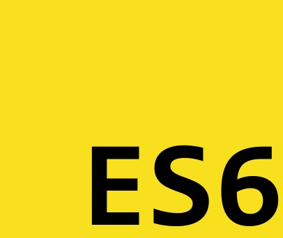

<h1 align="center">
    
</h1>

<h3 align="center">
  Rocketseat ES6 Challenges :book:
</h3>

This project is just the final exercises of each Rocketseat ES6 course module <a href="https://skylab.rocketseat.com.br/journey/starter">ES6 Starter</a> 🎓

## Contributing

1.  Fork the project
2.  Create your feature branch (`git checkout -b feature/AmazingFeature`)
3.  Commit your changes (`git commit -m 'Add some AmazingFeature'`)
4.  Push to the branch (`git push origin feature/AmazingFeature`)
5.  Open a pull request

## License

